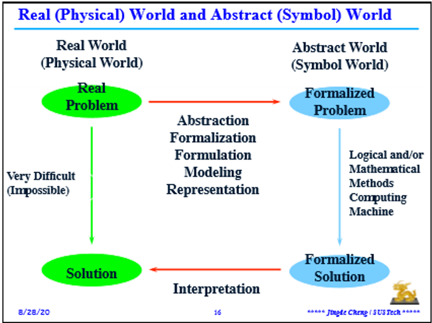
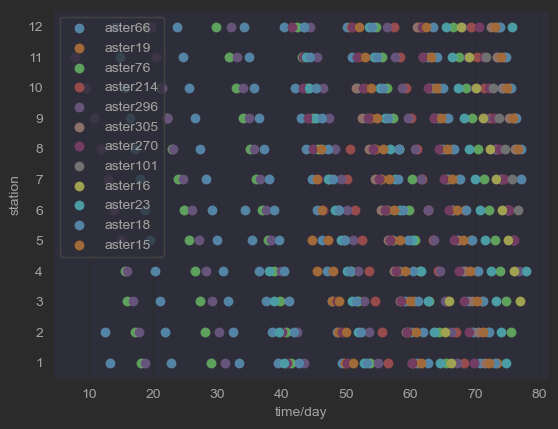
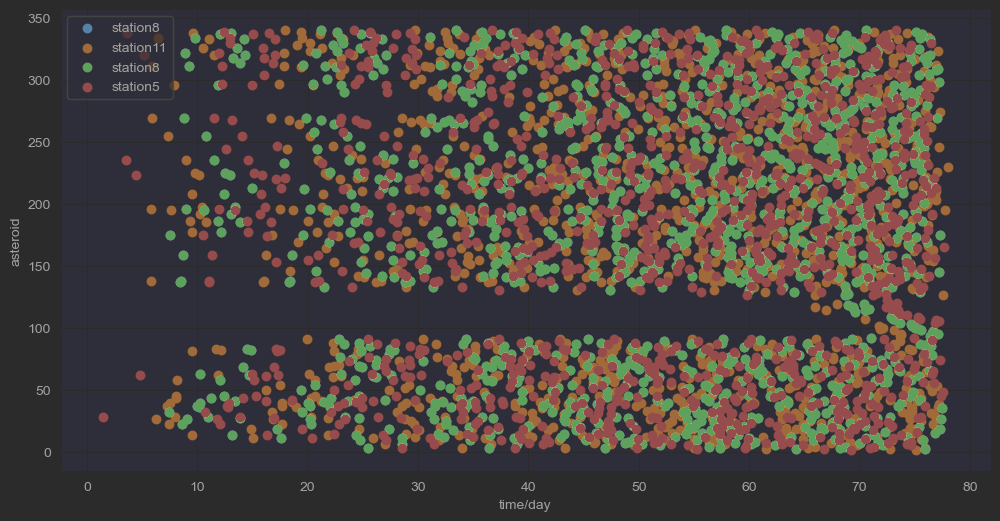
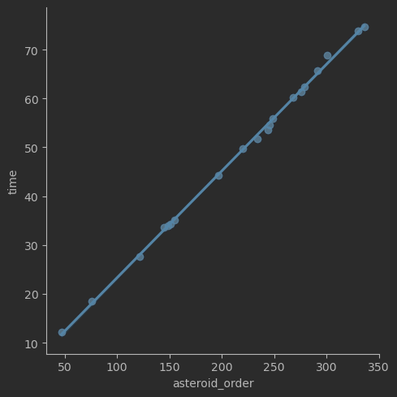

# 鞭辟入里——空间站采集分配优化问题的有效表征分析

    叶璨铭, 12011404  
    南方科技大学  
    12011404@mail.sustech.edu.cn  

<!-- SUSTech CS Course of EA with its Application, Assignment 1, Final Report, March 2023 -->

## Abstract

*关键词：* 演化计算、动态规划、强化学习、表征学习、多目标优化

## Contents

[TOC]

---

## 1. Introduction

### 1.1 研究背景

### 1.2 项目要求

## 2. Related Work

### 2.1 演化计算

演化计算是一种基于生物进化原理的优化方法，它通过模拟自然界中的进化过程，不断地从种群中筛选出适应度高的个体，并通过遗传操作（交叉、变异等）产生新的个体，最终得到最优解。演化计算在最优化理论与方法中占有重要地位，它可以用于求解各种复杂的优化问题，如函数优化、组合优化、约束优化等。演化计算与其他最优化方法相比，具有全局搜索能力强、鲁棒性好、易于并行处理等优点。[^5]

### 2.2 动态规划与强化学习

动态规划的核心思想是将一个大问题分解成若干个小问题，通过寻找子问题的最优解可以得到问题的最优解，并且可以找到子问题状态之间的递推关系。

强化学习是一种机器学习方法，它通过智能体与环境的交互来学习如何做出决策。近年来，深度强化学习（Deep Reinforcement Learning）已经成为强化学习领域的热门研究方向。目前，深度强化学习最核心的技术还是AlphaStar，OpenAI Five这一整套技术[^2]。近年来，强化学习方法受到了广泛的关注，其主要被用于解决序列决策问题[^3]。来自麻省理工学院计算机科学与AI实验室（CSAIL）的研究人员创造了一种算法。艾伦·图灵猜想可以制造一台能够自我学习并不断从自身经验中获得改进的下棋机器，而诞生于 2017 年的 AlphaZero 作为一种神经网络驱动的强化学习机器实现了图灵的猜想[^4]。

## 3. Effective formalization of acquisition allocation optimization problem for space station

### 3.1 什么样的解表征方式是好的？

#### 3.1.1 什么是解表征方式？为什么解的表征很重要?

解表征方式（Representation of Solution）是对待求解问题的解的表达形式。如图所示，计算机科学是建立可计算模型[^6]来求解现实问题的艺术，使用计算机科学求解问题的过程是将原问题表达为形式化问题输入、求解形式化问题、将形式化问题的输出翻译为原问题的解的过程。解表征方式的确定就是决定问题形式化的过程中如何表达问题的输出。计算机科学也是多层抽象的过程，问题被不断翻译为更加好求解的问题，再不断地返回结果给上一层抽象。

在演化计算研究领域中，**待求解问题**与**问题的解决方法**是两个不同研究重点，从大的方面来分，演化计算可以解决优化问题，以及通过优化问题来解决建模问题（即机器学习或者模式识别问题）和仿真问题。[^1]而就优化问题而言，可以**根据目标函数、问题约束的存在与否将待求解问题分为约束优化问题（COP）、约束满足问题（CSP）、自由优化问题（FOP）**和非优化问题。**相同的现实问题**往往通过**不同的问题形式化**（其中包括对解的表征方式的形式化）成为不同类型的问题，因此也有**不同的求解难度**，比如[^1]

- 八皇后问题
  - 可以形式化为CSP：棋盘上摆放8个皇后，使得满足任意两个皇后不能互相攻击
  - 可以形式化为FOP：优化使得皇后之间互相攻击的数量最少

Eiben和Smith指出, 要想成功运用演化计算来解决问题，较好的实践应当是针对特定的问题类型进行设计的，提出“技巧GA”必定是在一定的问题表示下才能奏效。[^1]八皇后问题实际上就是一个很简单但是能清晰说明这一点的例子。

- 八皇后问题的几种解表征方式
  1. 表示为8个皇后期盘上坐标的集合。
  2. 8个皇后是相同的，没有编号关系，所以表示为坐标的8维有序列表，而不是集合。
  3. 注意到皇后攻击的特点，每一行必定有一个皇后，于是表示为每一行皇后所在列数的列表。
  4. 注意到皇后攻击的特点，每一列也只能有一个皇后，其实皇后所在列的是互斥的，所以可以表示为一个8维permutation。

这四种解表征方式完全不同，他们的求解难度也截然不同。我们可以注意到，第四种表示方式比前面三种，有效的消除了约束条件，使得可行域的范围更加清晰可见。解的表示本身决定了解搜索空间的大小，第四种表示方式明显降低了搜索空间大小，减少了算法运行中大量的无效搜索，因此也更容易求解。

#### 3.1.2 什么样的解表征方式是好的？

我们当然知道，可以简单的把约束转换成优化目标，违反约束了就给一个惩罚函数。但是

对于最优化问题，实际上没有什么银弹

在本题中，原始的解表征是很差的一种表示方式。仅仅知道违反了约束，很难通过有效的算子变为有约束问题。

### 3.2 表征约简：空间站视角与小行星视角

我们很容易观察到原始表征的一个冗余点：当小行星被谁采集

#### 3.2.1 空间站视角：水滴切换问题

我们首先从空间站的视角来看待问题。对于一个空间站来说，随着时间的流逝，小行星们会一次次出现在空间站的面前

面对这样一个视角，我们可以很容易的将问题简化为一个动态、单人的游戏，本文命名该游戏为“水滴（Water drop）切换问题”：

- 游戏背景
  - 由n条装备了先进技术的太空飞船组成的太阳系舰队（即原问题中的asteroids）排列在太空中，
  - 排列成**宽12行长达80km**的矩阵防御带，
  - 对迎接三体世界的“礼物”水滴的仪式严阵以待。
  - 然而，水滴却有一个不同寻常的使命——摧毁人类舰队。
- 游戏操控：你将扮演三体水滴执行官，实时控制**一颗**水滴上下移动（切换行）。
- 游戏目标：摧毁太阳系舰船可以获得ABC三种物质，需使在每一行采集最少的物质的行最少采集量最大。
- 游戏约束
  - 当水滴上下切换行时，为了避免地球舰队还有有生力量，水滴的AI系统**自动控制超强激光在离开这一行前摧毁这一行的所有舰船**，**激光远程摧毁的舰船的燃料无法被收集**。
  - 人类舰船之间存在量子通信，当一艘舰船被摧毁时，**与之通信的舰船会得知水滴很厉害的信息，立刻开始逃逸，从而无法被水滴打击**。
    - 智子已经提前探测了舰船之间的量子通信关系网络，发现有340个通信频道（即原问题的asteroids编号）。
    - **一条舰船只有一个量子通信频道，相同频道的舰船之间可以相互通信**，不同频道的无法及时通信（只能通过电磁波通信，战争结束了才能收到信息）。
  - 水滴在一行直线前进的距离不少于1km，才能切换行。

#### 3.2.2 小行星视角：四维碎片守护问题

- 游戏背景
  - 在一次探险中意外发现君士坦丁堡的真相，人类提前掌握了四维碎片的收集技术与使用方法，正在赶往太阳系路上的三体文明感到了严重威胁。
  - 三体元首立刻下令派出**340颗水滴**进攻太阳系舰队，以便进一步摧毁位于木星上的四维碎片收集装置。然而，等待这些水滴的是地球舰队的四维碎片武器。
  - 尽管人类掌握四维碎片的时间不久、相关技术还不成熟，针对340个水滴大敌来袭，四维碎片工厂还是紧急生产了**340块四维碎片**。游戏过程中四维碎片无法生产。
  - 太阳系舰队排列成宽340行长达80km的矩阵防御带，**每一行舰队所有飞船中有且仅有一块四维碎片，面对的敌人有且仅有一个水滴。**
- 游戏操控：作为太阳系舰队四维碎片作战部司令，你需要**决策每一行的那一块四维碎片资源分配给哪一条飞船**。
- 游戏约束
  - **水滴经过装备了四维碎片武器的舰船时被消灭，材料被收集**。
  - 水滴飞行过程中材料会消耗，**越早攻击水滴，你获得的材料越多**。
  - 四维碎片武器有**12种型号**，不同型号的使用方式不同，**每一条飞船只有一个型号的武器。**
  - 由于可能的四维坍缩问题，**当相同型号的四维碎片武器放置四维碎片时，中间形成一条安全禁区带**，**禁区带内不能使用其他型号的四维武器**，否则会产生共振。禁区带还会往两边**蔓延1km**。
- 游戏目标：消灭水滴可以收集ABC三种物质，需使在每种型号的武器采集最少的物质的型号最少采集量最大。

### 3.3 表征选择：动态规划与静态规划

### 3.4 表征选择：单目标优化与多目标优化

### 3.5 表征选择：端到端优化与交替优化

## 4. Methodology

### 4.1 初值设置：基于探索性数据分析的几种启发式算法

#### 4.1.1 寿司转盘假设

### 4.2 演化计算

### 4.3 强化学习

## 5. Experiments

## 5. Conclusion

# 参考文献

[^1]: A. E. Eiben and J. E. Smith. Introduction to Evolutionary Computation. Springer-Verlag, Berlin, 2015.
[^2]: 深度强化学习的现在，将来与未来 - 知乎. https://zhuanlan.zhihu.com/p/367326621 访问时间 2023/4/14.
[^3]: 深度强化学习算法与应用研究现状综述 - 知乎. https://zhuanlan.zhihu.com/p/433114679 访问时间 2023/4/14.
[^4]: 2022年度强化学习领域19个重要进展汇总 - 智源社区. https://hub.baai.ac.cn/view/22902 访问时间 2023/4/14.
[^5]: 最优化：建模、算法与理论/最优化计算方法 - pku.edu.cn. http://faculty.bicmr.pku.edu.cn/~wenzw/optbook.html 访问时间 2023/4/14.
[^6]: 科学网—何谓“计算”？—可计算性理论简介—程京德的博文. (n.d.). Retrieved April 14, 2023, from https://blog.sciencenet.cn/home.php?mod=space&uid=2371919&do=blog&id=1383722
[^7]: Stuartj. Russell, PeterNorvig, 诺维格, 罗素, 祝恩和殷建平, 《人工智能:一种现代的方法》, 清华大学出版社, 2013, doi: [9787302331094](https://doi.org/9787302331094). 

